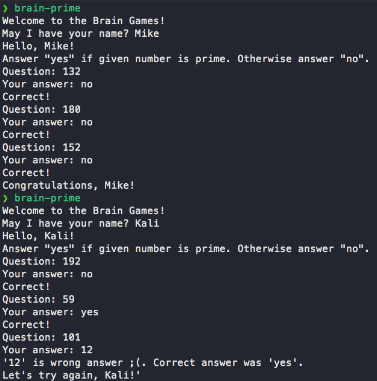

### Hexlet tests and linter status:
[](https://github.com/omnidark/python-project-lvl1/actions/workflows/hexlet-check.yml)[](https://codeclimate.com/github/omnidark/python-project-lvl1/maintainability)[](https://codeclimate.com/github/omnidark/python-project-lvl1/test_coverage)

> Установка игр:

```
make package-install
```

> Запуск игр (если добавлена переменная $PATH)

```
brain-calc
```
### Brain calc demo


```
brain-even
```

### Brain even demo


```
brain-progression
```

### Brain progression demo


```
brain-prime
```

### Brain prime demo

